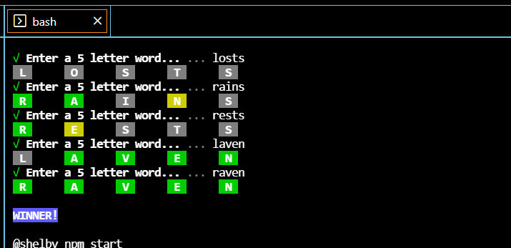

# nordle
wordle with node for your terminal!

# Run the project:
1. fork or download the source code.
2. run `npm install` in the root of the folder 
3. run `npm start` to begin the game in your terminal
4. You have 6 tries to guess the word.

*Node v12 or Higher required*